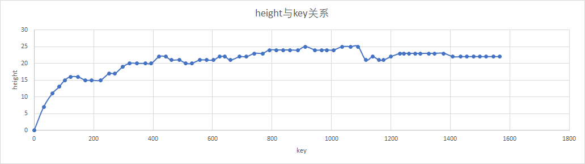

# Lab1 实验报告

姓名：杜心敏

学号：521021910952

### 1. 操作耗时分析

#### 1.1 breakdown方式

在`test.cc` 中的`switch`语句中，先对主要的6个操作（不包含前序遍历）进行了用时记录，调用次数记录，最后求取**平均耗时**。

如`insert` 操作

```cpp
//全局变量定义
int total_insert_time(0);
int insert_num(0);
//switch语句中
case 1:
    insert_num ++;
    start=rdtsc();
    treap.insert(val);
    end=rdtsc();
    total_insert_time += end-start;
    fout << treap.pre_traverse() << std::endl; //不记录前序遍历时长
    break;
```


#### 1.2 操作平均时长

测试用例：`data/input-3.txt`

测试操作：6个对外接口的操作，以及`merge` 和`split`

由于将更新size的操作拆成一个函数，所以对`update_size` 也进行了测试

```
output: (/cycles)
average insert time:19057
average remove time:19475
average rank time:44453
average kth time:7652
average pre time:35031
average suc time:34194
average split time:432
average merge time:245
average update size time:14516
```

其中每个操作包含的子操作（merge，split）如下：

```
//insert:
split(val, treap_root,&left, &right);
merge(left, newNode, &temp);
merge(temp, right, &treap_root);
update_size(treap_root);

//remove:
split(val, treap_root, &left, &right);
split(val-1, left, &subLeft, &subRight);
merge(subLeft, subRight, &temp);
merge(temp, right, &treap_root);
update_size(treap_root);

//rank:
split(val-1, treap_root, &left, &right); 
update_size(left);
merge(left, right, &treap_root);
update_size(treap_root);

//kth: none

//pre:
split(val-1, treap_root, &left, &right);
update_size(left);
merge(left, right, &treap_root);
update_size(treap_root);

//suc:
split(val, treap_root, &left, &right);
update_size(right);
merge(left, right, &treap_root);
update_size(treap_root);
```


#### 1.3 分析

可以看到所写的`update_size` 耗时比较长，因为每次都需要全部遍历一次。

这种写法可以保证程序的正确性，但是在rank等操作中，需要两次`update_size` 的地方，可能存在部分的重复遍历，尚可优化。

### 2. 树高与key的关系

#### 2.1 测试方法

测试用例：测试用例：`data/input-3.txt`

取消了input-3中所有`remove`操作

记录调用`insert` 的次数，每100次输出`heigtht` 和`key`

#### 2.2 数据处理



#### 2.3 分析

* 刚开始，key增加，height上升很快。随后，height的增长比较平缓。
* 说明树的平衡性较好，在之后出现了height下降情况，应该是在split和merge操作后，树找到了更好的平衡点。

