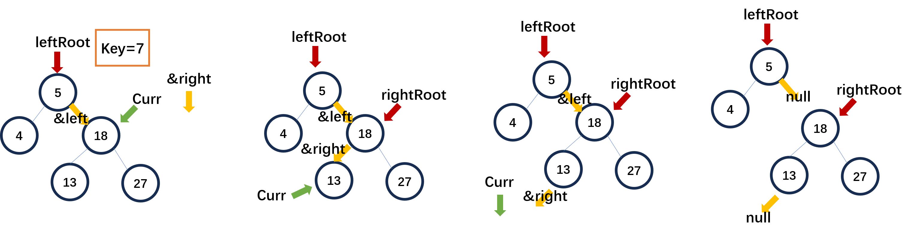

# Treap

[TOC]

### 1. Treap

#### 特性

* ⼀种弱平衡的搜索树：tree+heap

* 每个节点储存⼀个weight，节点的权重。

* 节点满⾜⼆叉搜索树 + ⽗节点的weight⼤于两个⼦节点的weight

  key值满足二叉树，weight满足堆

#### 插入

1. 按照⼆叉搜索树的⽅法插入，建⽴新的节点，存储元素和随机权重。
2. 从新节点开始向上旋转，直到满⾜⽗节点的权重⼤于⼦节点的权重。

#### 删除

* 按照⼆叉搜索树的⽅法找到要删除的节点。

  * 叶⼦节点直接删除

  * 有两个⼦节点，选择权重较⼩的⼦节点进⾏旋转。

    重复，直到将要删除的节点转移到叶⼦位置。 

### 2. 无旋Treap

FHQ Treap

通过分裂合并来实现增删改查

#### 分裂

按照某个key，分成左子树（值小于等于key），右子树

```cpp
void split(T val, TreapNode<T>* curr, TreapNode<T>** leftRoot, TreapNode<T>** rightRoot) {
        if( !curr) { //如果当前节点为空
            *leftRoot = *rightRoot = nullptr;
            return;
        }
        if( val < curr->val) { //如果当前节点的值大于val
            // 然后右子树的根节点递归到curr->left（因为右侧必然大于val，连枝放进rightRoot）
            // leftRoot不变向下传递
            split(val, curr->left, leftRoot, &curr->left);
            *rightRoot = curr; //curr放入右子树
        } else {
            split(val, curr->right, &curr->right, rightRoot);
            *leftRoot = curr;
        }
    }
```



找到左子树根节点后，之后传递的leftRoot严格来说不是根节点，下一次生长是从左子树右枝。（左子树的左枝就全部进入左子树）

代码没有涉及回溯

#### 合并

保持最大堆的性质

```cpp
void merge(TreapNode<T>* leftRoot, TreapNode<T>* rightRoot, TreapNode<T>** root) {
        //合并时要保持最大堆的性质
        if( !leftRoot) {
            *root = rightRoot; return;
        }
        if( !rightRoot) {
            *root = leftRoot; return;
        }
        if( leftRoot->weight < rightRoot->weight) {
            //rightRoot成为新的root
            // merge三段：leftRoot, rightRoot->right，rightRoot->left
            //BST性质：leftRoot与rightRoot->left合并，放到rightRoot的左子树
            merge(leftRoot, rightRoot->left, &rightRoot->left);
            *root = rightRoot; //weight大的作为root
        } else {
            merge(leftRoot->right, rightRoot, &leftRoot->right);
            *root = leftRoot;
        }
    }
```

* 堆的性质：比较左右子树的权重，大的作root
* 二叉树的性质：合并leftRoot和rightRoot->left，一起作为rightRoot的左子树


#### 插入

* 用val划分
* 搜索左子树
  * 存在，count++
  * 否则创建新节点，与左子树merge
* 左右子树merge

#### 删除

* 用val划分
* 再次用val划分左子树
* 搜索sub右子树（最多一个节点）
  - count > 1，count--
  - 否则删除该sub右子树
* 左右子树merge

#### 查看排名

用该val划分树，数数左子树


