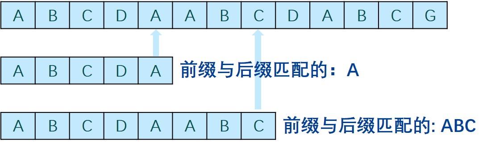

# KMP

[TOC]

### 0. 综述

1. 减少回退，空间换时间
2. 状态机：状态转移
3. 用`next` 记录前缀


### 1. next表

前缀后缀匹配最长字符串的长度



| index | -1      | 0    | 1    | 2    | 3    | 4    | 5    | 6    | 7    | 8    | 9    | 10   | 11   | 12   |
| ----- | ------- | ---- | ---- | ---- | ---- | ---- | ---- | ---- | ---- | ---- | ---- | ---- | ---- | ---- |
| P     | *(通配) | A    | B    | C    | D    | A    | A    | B    | C    | D    | A    | B    | C    | G    |
| next  |         | -1   | 0    | 0    | 0    | 0    | 1    | 1    | 2    | 3    | 4    | 5    | 2    | 3    |


#### 代码构造

* 已知next表中前[0,j]项，推出$next [j+1]$
* 有 $next[j+1] \le next[j]+1$
  * 若$P[j] == P(t)$，$next[j+1] = next[j]+1$
  * 否则，循环替换 $ t=next[t] $，直到满足上条

```cpp
int* buildNext(char* P) { 
    size_t m = strlen(P), j = 0; //“主”串指针
    int* Next = new int[m]; //next表
    int t = Next[0] = -1; //模式串指针
    while (j < m - 1)
        if (t < 0 || P[j] == P[t]) { //匹配
            j ++; t ++;
            Next[j] = t; 
        } else //失配
            t = Next[t];
    return Next;
}

j = 1  t = 0   Next[1] = 0

P[1] = b, P[0] = a
back: t= -1
j = 2  t = 0   Next[2] = 0

P[2] = c, P[0] = a
back: t= -1
j = 3  t = 0   Next[3] = 0

P[3] = d, P[0] = a
back: t= -1
j = 4  t = 0   Next[4] = 0

P[4] = P[0] = a
j = 5  t = 1   Next[5] = 1

P[5] = a, P[1] = b
back: t= 0
P[5] = P[0] = a
j = 6  t = 1   Next[6] = 1

P[6] = P[1] = b
j = 7  t = 2   Next[7] = 2

P[7] = P[2] = c
j = 8  t = 3   Next[8] = 3

P[8] = P[3] = d
j = 9  t = 4   Next[9] = 4

P[9] = P[4] = a
j = 10  t = 5   Next[10] = 5

P[10] = b, P[5] = a
back: t= 1
P[10] = P[1] = b
j = 11  t = 2   Next[11] = 2

P[11] = P[2] = c
j = 12  t = 3   Next[12] = 3

```

#### 复杂度

构表：$O(m)$

### 2. 主代码

```cpp
int match(char* P, char* T) { 
    int* next = buildNext(P); 
    int n = (int) strlen(T), i = 0; //主串指针
    int m = (int) strlen(P), j = 0; //模式串指针
    while ((j < m) && (i < n)) //自左向右逐个比对字符
    if (j < 0 || T[i] == P[j]) //未越界且匹配
    	{ i ++; j ++; } //转到下一字符
    else //否则
    	j = next[j]; //模式串右移，主串不回退
    delete [] next; 
    return i - j;
}
```

#### 复杂度

遍历：$O(n)$

### 3. 小结

* 复杂度：$O(m+n)$
* 与模式串长度无关