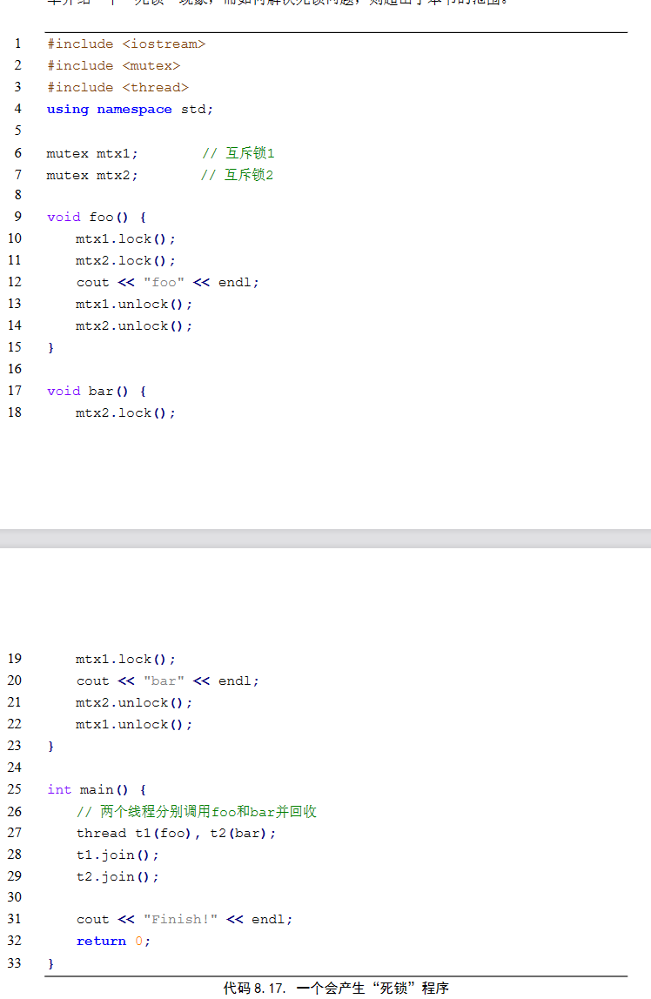

# Parallel Program

[TOC]

### 1. 多线程库

```cpp
thread() noexcept; // 1. 默认构造器
template <class Fn, class... Args>
explicit thread (Fn&& fn, Args&&... args); // 2. 初始化构造器
thread (const thread&) = delete; // 3. 复制构造器[删除]
thread (thread&& x) noexcept; // 4. move构造器
void thread::detach();
void thread::join();
bool thread::joinable() const noexcept;
```


### 2. 锁

防止数据竞争：counter++本身是由三条汇编指令构成的

```cpp
int countNum = 0; // 全局变量
mutex mtx; // 互斥锁，#include <mutex>
void counter() {
    mtx.lock();
    for(int i = 0; i < 100000; i++)
    	countNum++;
    mtx.unlock(); //粗粒度锁
}
```

* 锁住共享变量
  * 全局变量
  * 静态变量
* 细粒度锁（比如将上述lock操作放在for循环里面）
  * 减少串行部分的执行时间，减少串行部分的执行时间
  * 但锁的使用是有开销

### 3. 线程安全

#### List

* mutex保护head指针
* find的时候保护List不被修改（锁住find整个函数）

#### 散列表

* 每个散列桶有自己的锁

### 4. 死锁

两个（或多个）线程在试图获取正被其他线程占有的资源时造成的线程停滞



`t1` 在`foo` 中拿到了`mtx2` ，`t2` 在 `bar` 里拿到了`mtx1`。

两个函数`mtx1.lock()` 和 `mtx2.lock()` 顺序不一致

#### 避免死锁

基本原则就是保证各个线程**加锁操作的执行顺序**是全局一致的


### 5. 避免使用锁

资源复制

* 让每个线程先维护一个自己的计数器，只在程序的最后将各个计数器两两归并

