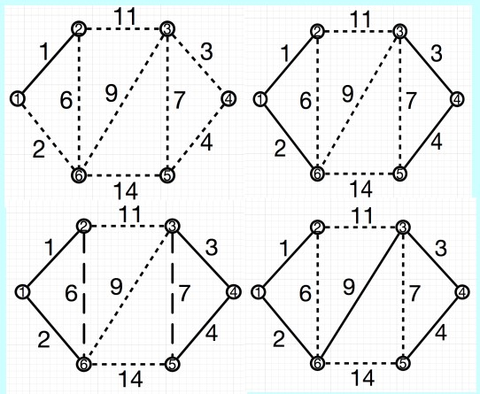

# 最小生成树MST

[TOC]

### 0. 综述

* 将所有顶点连起来，权重和最小
* 无环

#### Prim算法

可以从任意顶点开始构造最小生成树。

* 首先建立两个顶点集合X和Y。X包含G中任意一顶点， Y包含其余所有顶点

* 找出具有最小权重的边(x, y)，其中x∈X， y∈Y，把顶点y从Y移动至X。把边(x, y)加入到最小生成树中。
* 重复此过程直到Y为空。
* $O(n^2) $

#### 1. Kruskal简述

维护一个由许多生成树组成的森林，这些生成树逐渐合并直到产生唯一的一棵树为止。

1. 将所有边按权重，以非降序排列
2. 构建一个仅包含顶点（不含边）的森林(V,T)
3. 重复取出权值最小的边。如果这条边加入T后不成环，则加入，否则丢弃。
4. 向T中加完n-1条边后算法结束。

* $O(m \log m)$

如图，依次加入权重为1,2,3,4的边。加入6的时候成环（1,2,6），加入7成环，最终选择加入9。此时已经有{1，2，3，4，9} n-1条边，算法终止。

### 2. 并行：基于边

#### 划分图

需要将原图划分成若干不相交的分区。

为了尽量使各进程的负载均衡，计算量相当，采取基于哈希函数等均匀的划分方式。 

#### 部分算法+仲裁算法

部分算法：（子进程）

* 各进程收到来自全局进程的消息
* 选出本分区当中具有最小权重的边并发送
  给全局进程
* 处理完后等通知

仲裁算法：（全局进程）

* 全局进程首先向所有并行进程发送消息获取各分区最小权重边构成队列Q。

* 循环取出Q中权值最小的边e，并向提供边e的进程发送消息

  （请求补充新的最小权重边至Q中）

* 如果取出的边e加入到结果集T中不会构成环路则保留此边，若会构成环路则将其丢弃。

* 当T中的边的数量为|V|-1或队列Q为空时算法结束，同时通知各进程结束算法。 

### 3. 并行：基于点

Boruvka算法

* 构造一个结果集T=(V,S)，其中S为空集，包含G中所有顶点不含边的图

  每一个顶点属于一个独立的连通分量

* T中每个连通分量C，找出具有最小权重的边(x, y)，其中x∈C， y∉C，此边即为C的最小邻接权重边

* 将所有连通分量的最小邻接权重边并入集合
  S中

* 重复此过程直到图T中只存在一个连通分量为止

子进程分区Prim算法，全局Boruvka算法

“全局Boruvka算法”

* 等待并行进程的“分区Prim算法”执行完毕，将所有进程输出的结果集S‘ 合并得到集合
* 构造图T=(V,S)
* 以T作为上述非并行化Boruvka算法的初始结果集，执行Boruvka算法。直到算法结束
  