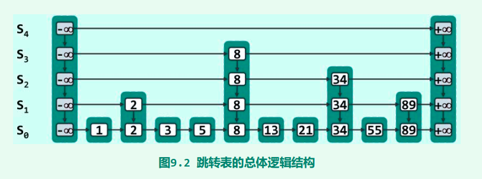

# SkipList_Note

[TOC]

### 0. 综述

* 平均需要$O(\log n)$，用空间换时间
* 继承于：**有序列表**，词典（键值对）
* 核心思想：**由粗到细**（由高到低），类似二分查找的思想

* 依据**概率**保持平衡


### 1. 理论支持

概率知识：

负二项分布期望：$NB(s,p)$， $ EX = \frac{s(1-p)}{p^2}$

几何分布($s=1$)期望 : $EX = \frac{1-p}{p}$

$ (1- \frac{1}{2^k}) \geq 1- \frac{n}{2^k}$


### 2. 结构



四联表：水平垂直方向都有前驱后继

```cpp
template <typename T> struct QuadlistNode { 
	T entry; //所存词条
    QuadlistNodePosi(T) pred, succ, above, below; //前驱、后继、上邻、下邻
};
```


### 3. 增删改查

##### 查找

主要逻辑：如果不够大就向下跳。

```cpp
while (true) { 
	while (p->succ && (p->entry.key <= k)) //检查是否到tail，与当前节点比较
		p = p->succ; //向后查找
	p = p->pred; //比当前结点小，倒退一步
    if (p->pred && (k == p->entry.key)) return true; //命中
    qlist = qlist->succ; //转入下一层
    if (!qlist->succ) return false; //已经是最底层，查找失败
    p = (p->pred) ? p->below : qlist->data->first(); //p转至下一层
}
```

查找长度：

如图，查找21：{-∞，-∞，8，8，8，8，13} （？？不比较34？）


##### 增加

给的代码真的是很麻烦

```cpp
while (rand() & 1) { //抛硬币，是否增长
    while (qlist->data->valid(p) && !p->above) p = p->pred; //最近前驱
    if (!qlist->data->valid(p)) { //前驱是header
        if (qlist == first()) //且是顶层
            insertAsFirst(new Quadlist<Entry<K, V>>); //创建新的一层
        p = qlist->pred->data->first()->pred; //到新一层的header
    } else 
        p = p->above; 
    qlist = qlist->pred; //上升一局
    b = qlist->data->insertAfterAbove(e, p, b); //插在p之后，b之上
}
```


### 4. 复杂度

#### 空间复杂度$O(n)$

增长：生长概率逐层减半，$S_0$ 中数据在$S_k$ 层出现概率为$2^{-k}$

第k层个数：$n\times 2^{-k}$

等比数列求和

#### 时间复杂度$O(\log n)$

类似二分

插入：访问的路径与查找相反，总数期望不超过$O(\log n)$


> 不重要的证明

较好的高度：$L(n) = \log_{\frac{1}{p}}n$

##### 分析

爬到k层需要的代价：$C(k) = p(1+C(k-1))+(1-p)(1+C(k))$

- p：向上跳
- 1-p：该层已经到顶了，向右跳

解得：$C(k) =\frac{k}{p}$

**upper bound**：$\frac{L(n)-1}{p}$

左移的界限$L(n)$，最高层大于k概率 = $1-(1-p^k)^n \leq np^k$

有n个元素的跳表：  $E(cost)=\frac{L(n)}{p}+\frac{1}{1-p}$

**复杂度**：$O(\log n)


### 跳表VS红黑树

增删改查时间复杂度一样。

查找**某个区间内的数据**时，跳表可以找到起点，然后依次遍历。

