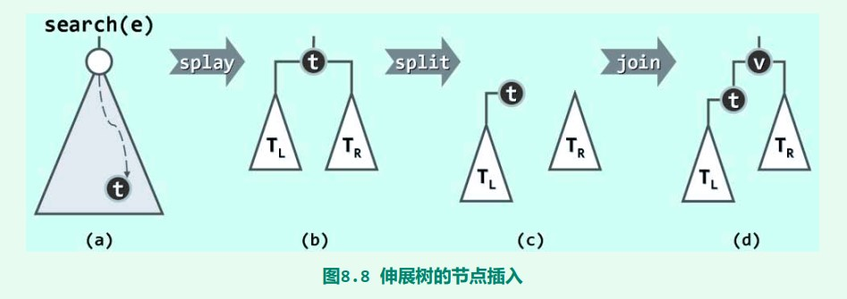

# Splay Tree

[TOC]

### 0.综述

建立在二叉搜索树上

**程序局部性原理**的假设：一个节点在一次被访问后，这个节点很可能很快再被访问。下一次访问的可能在它周围。

伸展树：每次一个节点被访问后，把它**推到树根**的位置。

最坏情况下：单次操作O(N)的时间

实际证明：保证M次连续操作最多花费$O(MlogN)$ 的时间。

> 连续M次查找（M>>N=|BST|），AVL需$O(MlogN)$ 

### 0.5. Catalan数

n个元素进栈序列固定，有多少种出栈序列 / 括号匹配 / 二叉树形状

所有路径：$C_{2n}^n$

非法：$C_{2n}^{n+1}$

合法：$C_{2n}^n - C_{2n}^{n+1} = \frac{1}{n+1}C_{2n}^{n}$

### 1. 双层伸展

和AVL类似。注意儿子的改变

 一字型

 之字型

### 2. 对比单层伸展

在最坏的情况下：

 双层 

 单层 

* 单层选择中，所有节点的深度都因为1成为根加了1
* 单层旋转后，如果连续访问最远的，会变回最差情况，每次访问$O(n)$
* 而双层旋转在一次最坏访问之后，对应分支长度减半。不会连续高频出现最坏访问情况

### 3. 增删

#### 插入key

先search，然后root可能为key，或key的直接前后驱，直接在树根操作

#### 删除key

* 查找，目标key位于root
* 删除root，分为左右子树
* 从右子树查找key
* 失败但是root设为右子树最小值，以此为根

### 4.自顶向下的伸展树

自底向上：需要用栈来保存访问路径，进行回溯

自顶向下：只用O(1)的存储方式

* 新设两个“左树” “右树”
* 开始时左树和右树都是空树，待伸展的树为中树

 一字型

* Y和X一次旋转
* 将Y节点作为R树的最左节点的左儿子。

 之字型

* Y作为L树最右节点的右孩子
* X作为R树最左节点的左孩子

 合并

### 5.评价 VS AVL

* 不用记录height、平衡因子
* 复杂度与AVL相当$O(\log n)$
* 局部性强、缓存命中率极高时（k << n << m），效率甚至$O(\log k)$。连续m次查找，可以在$O(m\log k+n\log n)$完成

> k 查找集合大小，n 总量，m 查找次数。很多次查找很集中的时候

