# Red Black Tree Note

[TOC]

### 0. 综述

* 自平衡二叉查找树
* 增删改查时间复杂度$O(\log N)$
* 红黑树中，最长的路径的长度，不会超过最短的路径的长度的2倍

### 1. 颜色规则

- 任意结点都有颜色，红或黑
- root黑色
- null（叶子）为黑色
- 红红不能相邻（红结点的父亲、儿子都是黑的）
- 从root 到null的黑结点数量相同（黑深度相同）

红黑树中，最长的路径的长度，不会超过最短的路径的长度的2倍

> 最短路径，必然都是由黑色节点构成。最长路径，必然是由红色和黑色节点相间构成。红结点不连续、黑高度相同。故不会超过两倍关系

### 2. 2,3,4树与RB树

#### 高阶b树的分裂

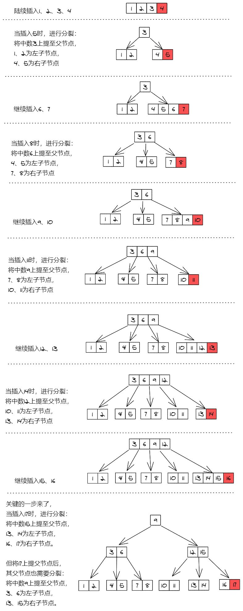

#### 高阶b树的删除

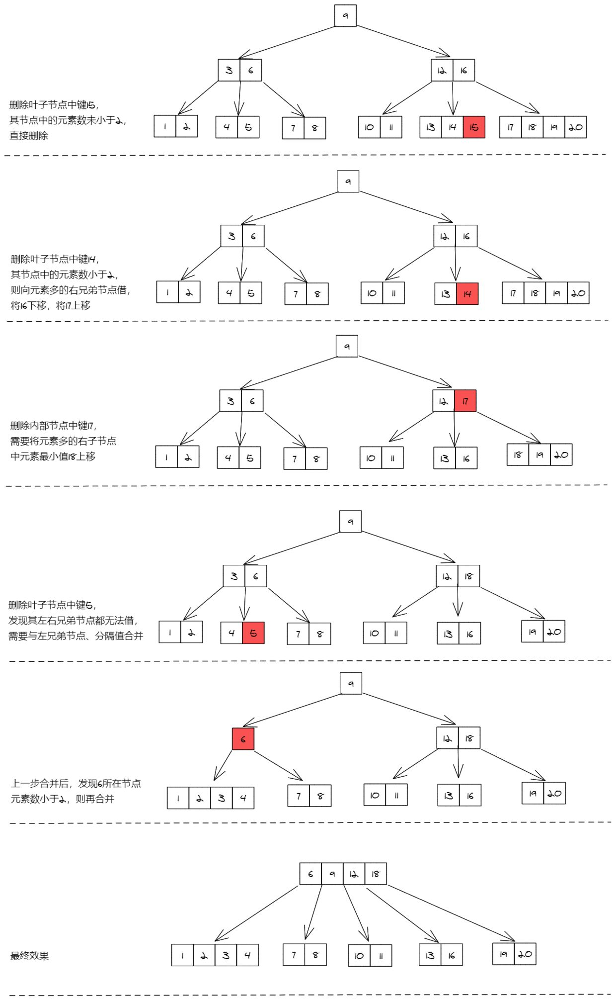

#### 2，3，4树中染色

* 2节点（有两个儿子）对应黑色节点
* 非2节点是以**红节点+黑节点**的方式存在：红节点的意义是与黑色父节点结合，表达着2-3-4树中的3，4节点。

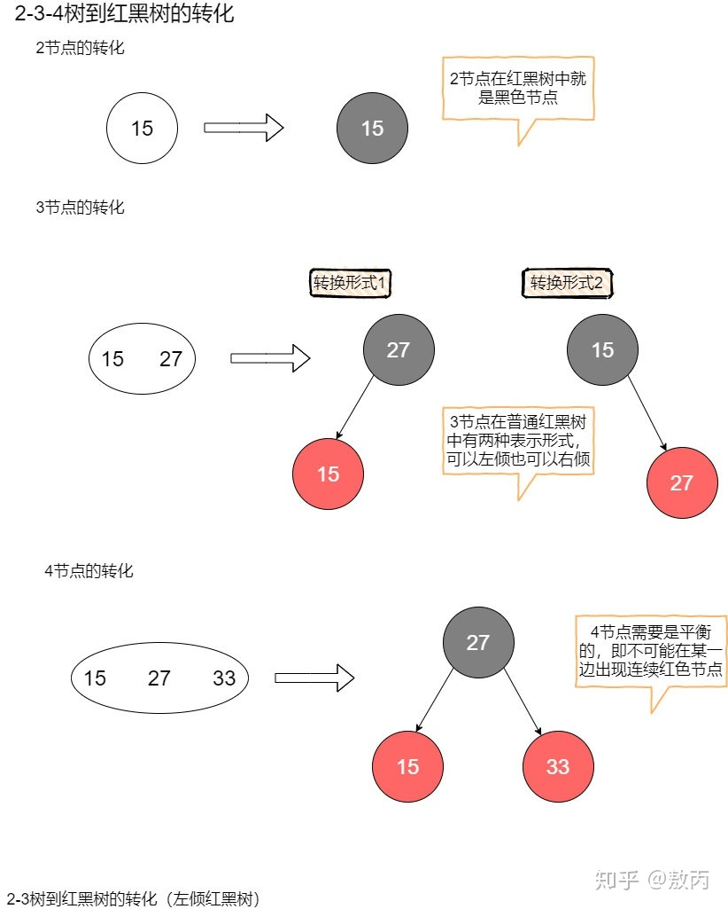

#### 2，3，4树转化为红黑树

将红结点提到喝父节点同一高度（旋转45°）

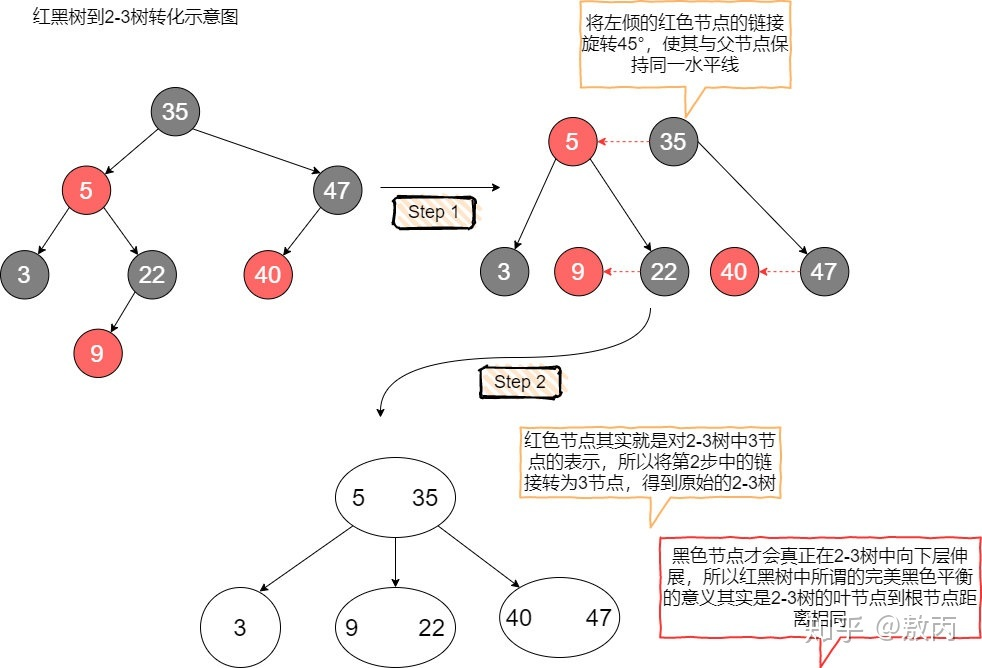

### 3. 增删改查

#### 插入

- 按照搜索树的特征进行插入

- 插入结点红色（否则黑高度改变）

  - 如果是**根节点**，将颜色改为黑色
  - 插入/调整的结点的**父结点是黑色的**，则插入完成
  - 插入的结点的父结点是红色的，则需要修复，且继续向上调整，直到为根或满足规则
  - 如果根修改之后为红色，一定要改过来，改为黑色

  

#### 修复

需要修复的：插入节点的父结点为红色。

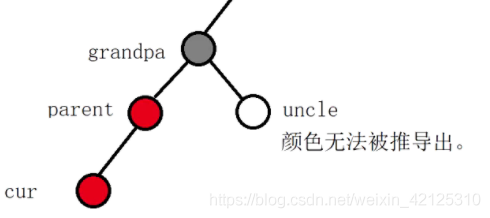

根据uncle的状态分类

1. uncle = 红色**（需要递归检查）**

   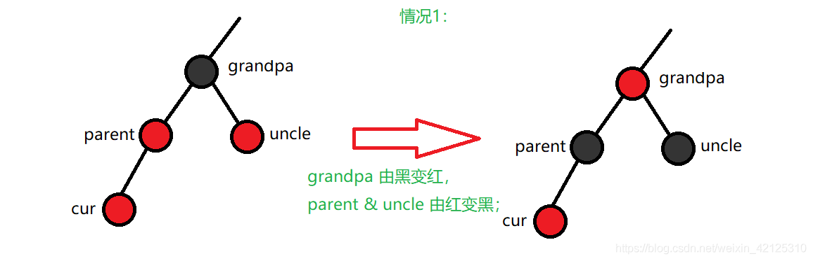

2. uncle = null 或者 黑色

   1. 插入左孩子，且parent是grandpa的左孩子

      parent成为祖父

      * grandpa 右旋，颜色变红色
      * parent 的颜色变为黑色

      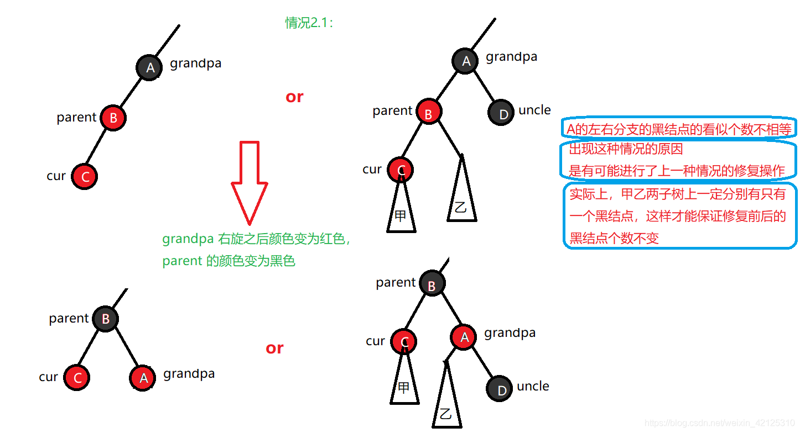

   2. 插入右孩子，且parent是grandpa的右孩子

      parent成为祖父

      - grandpa 左旋，颜色变红色
      - parent 的颜色变为黑色

      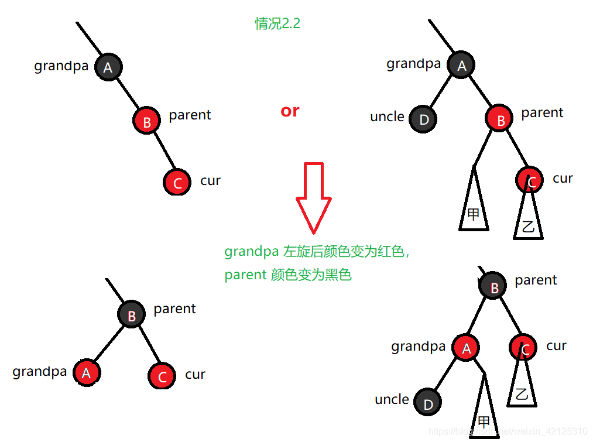

   3. 插入右孩子，且parent是grandpa的左孩子

      变成左左情况

      * parent左旋（与插入结点互换位置）
      * 2.1的情况：插入左孩子，且parent是grandpa的左孩子

      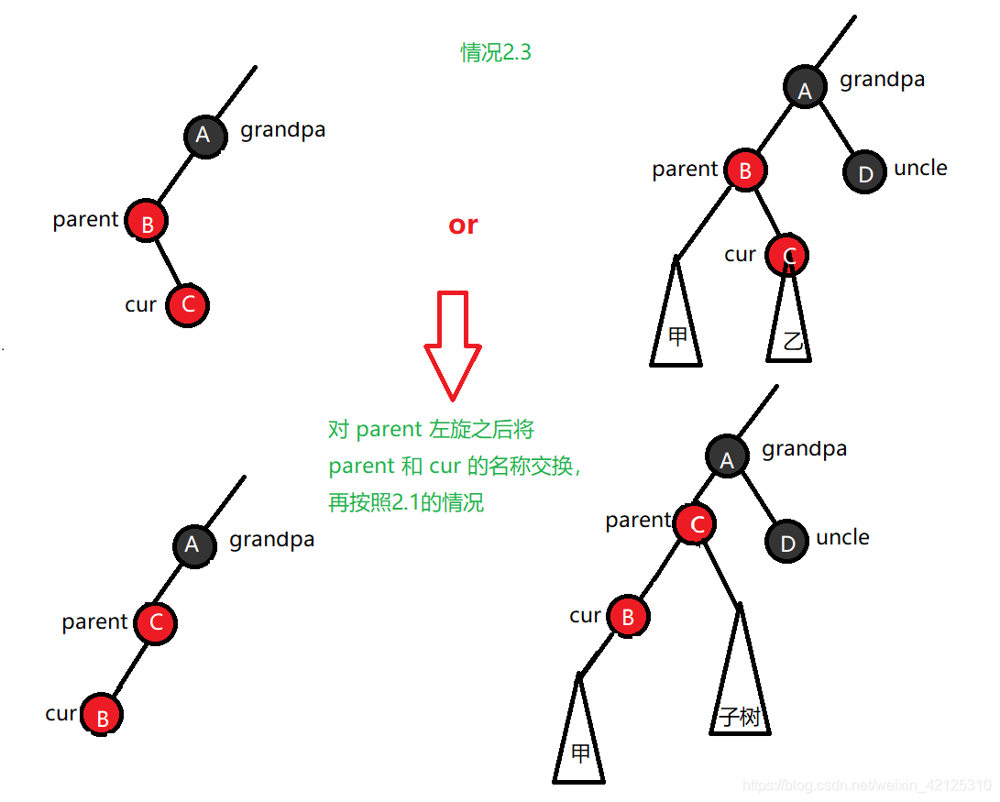

   4. 插入左孩子，且parent是grandpa的右孩子

      变成右右情况

      * parent右旋（与插入结点互换位置）
      * 2.2的情况：插入右孩子，且parent是grandpa的右孩子

      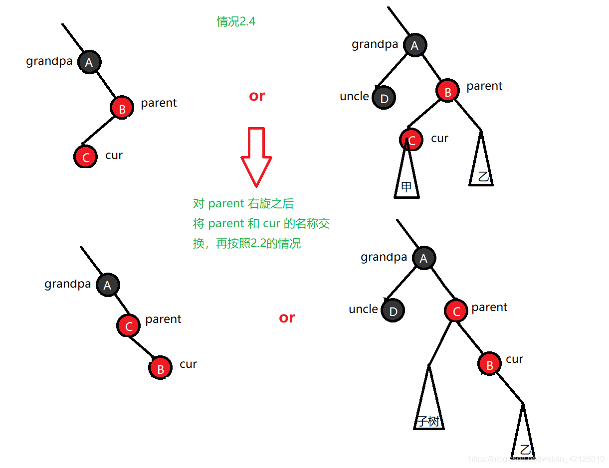

#### 删除

找到替身记为x，删除目标和x有一个为红，则完成。

从x开始循环调整。x最终设为黑色

根据兄弟、兄弟孩子颜色分类：

1. 兄弟为红

   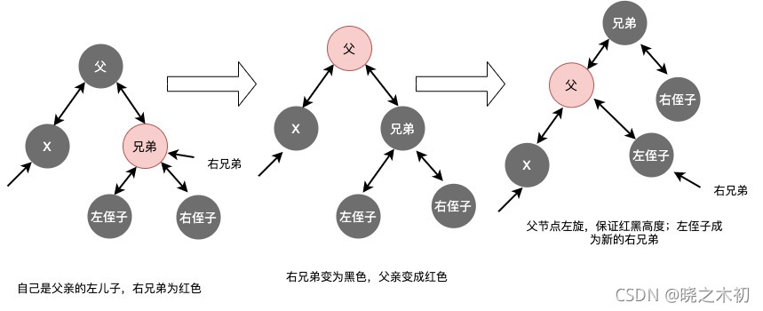

2. 兄弟为黑，兄弟两个黑儿子**(递归调整)**

   将兄弟变成为红色，递归调整父节点

   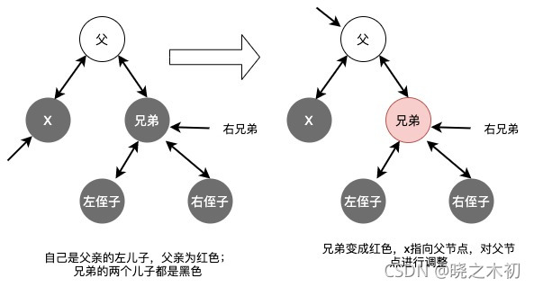

   

3. 兄弟为黑，兄弟左儿子红色

   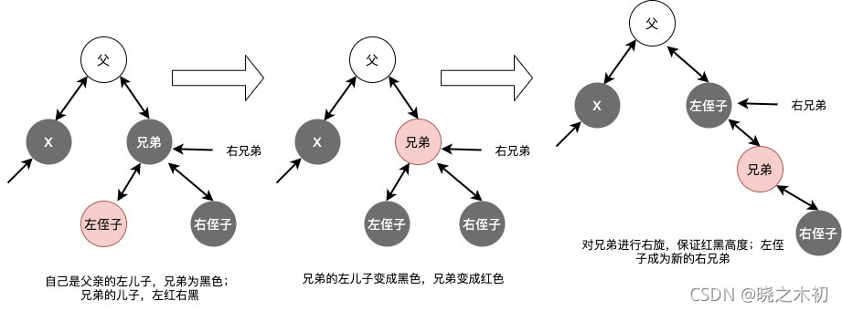

4. 兄弟为黑，兄弟右儿子红色（左儿子都可）**（递归调整）**

   （1）兄弟颜色改成与父节点一致，右侄子和父节点都变成黑色
   （2）为了保证父节点变为黑色后，不影响所有路径的黑色高度，需要将父节点左旋（兄弟节点上提）
   （3）向上递归

   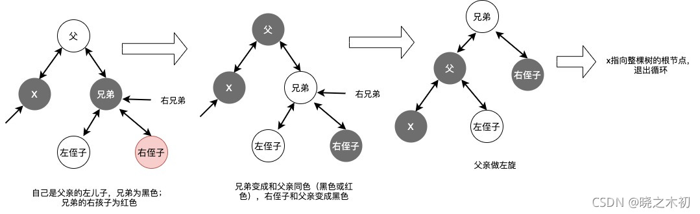

### 4. 复杂度

修正中只有双红修正需要递归检查：$O(\log n)$

查找和avl相当：$O(\log n)$

### 5. 评价 VS AVL

* 红黑树的插入操作更高效。AVL平衡要求更加严格，调整较多。
* 红黑树通过牺牲了一定的平衡性来换取更高的插入和删除操作的效率