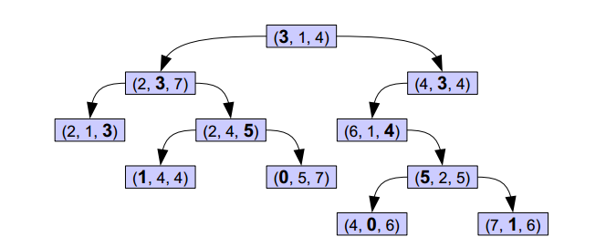
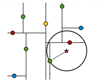
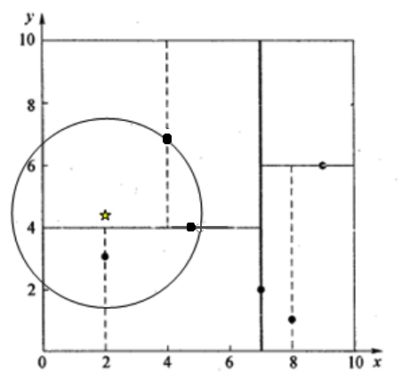

# KD Tree

[TOC]

### 0. 综述

* k维树，空间划分的数据结构
* 用于搜索最近邻居算法KNN
* 给定范围（矩形，立方体）内的点
* 每层搜索一个维度


### 0.5 其他算法

#### 容斥原理

时间$O(\log n)$

空间$O(n)$

### BBST

二叉树搜索方式，范围[a,b]

```cpp
queue q;

find(point, 范围)
    if curr < 范围
        find(curr.right, 范围)
    if curr > 范围
    	find(curr.left, 范围)
    else 
        q.push(curr)
        find(curr.right, 范围)
        find(curr.left, 范围)
```


### 1. 构造

* 依次循环选一个维度
* 该维度的中位数，（取大的？）
* 划分该维度

### 2. 搜索



加粗的为当前比较的key。

搜索同二叉树，但要先确定当前比较那个维度的key


### 3. 邻近搜索

* 按规则搜索，找到最近邻的近似点（与待查询点处于同一个子空间的叶子结点）

* 回溯搜索路径，判断路径上的结点的**其他子结点空间**中是否可能有距离查询点更近的数据点

  判断方式是，与分割轴距离比较（画圆看是否相交）

  * 如果有，跳到其他子结点空间中去搜索
  * 将其他子结点加入到搜索路径（queue）

* 重复，直到搜索路径为空



如上图，绿色为近似点，发现圆与轴相交，则要把另外半边的的点都加入

#### 例子

目标点为⭐



* 一路查下去，search_path：<(7,2), (5,4), (4,7)>
* 取出(4,7)为当前最佳结点nearest, dist为3.202
* 回溯至(5,4)，以⭐为圆心，以当前最短距离dist=3.202为半径画一个圆与超平面y=4相交。需要跳到(5,4)的左子空间去搜索。将(2,3)加入到search_path中。search_path：<(7,2), (2, 3)>
* 更新最短距离：(5,4)与(2,4.5)的距离为3.04 < dist = 3.202。(5,4)为nearest，dist=3.04。
* 回溯至(2,3)：叶子节点直接判断，nearest更新为(2,3)，dist更新为1.5
* 回溯至(7,2)：以⭐为圆心，以dist=1.5为半径画一个圆，不和超平面x=7相交。
* search_path为空。结束搜索。nearest(2,3)，dist=1.5

#### KNN

找k个最近的，用一个优先队列存储最优的k个点

```cpp
k_close(p,o,k,)  // 查询点p,树当前节点o,近邻数目k 
1. 从根节点开始递归的查找，根据p在节点的左边还是右边，决定递归方向 
2. 若到达叶节点,则将其作为当前最优节点 
3. 回溯: 
(1) 若当前节点比当前最优点更优，则将其作为当前最优节点 
(2) 判断左子树是否存在最优点，若有则递归下去 
4. 当根节点搜索完毕，则查找结束
```


k_close(p,o,k,)//查询点p,树当前节点o,近邻数目k 
1. 从根节点开始递归的查找，根据p在节点的左边还是右边，决定递归方向 
2. 若到达叶节点,则将其作为当前最优节点 
3. 回溯: 
(1) 若当前节点比当前最优点更优，则将其作为当前最优节点 
(2) 判断左子树是否存在最优点，若有则递归下去 
4. 当根节点搜索完毕，则查找结束

### 4. 范围查找

```cpp
find(region,o)//范围，当前节点 
	ret =0 
	if 叶子节点：　
		ret += (o在region 内部)
	if 与左子树相交
		ret += find (region,lc) 
    if 与右子树相交
		ret += find (region,rc) 
```

时间复杂度$O(\log n)$

空间复杂度$O(n)$

### 5. 退化

多点共垂直/水平，寻找更好的划分规则

* 引入轻微扰动
* 划分方差大的维度
* 排序确定median