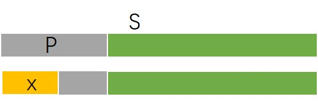
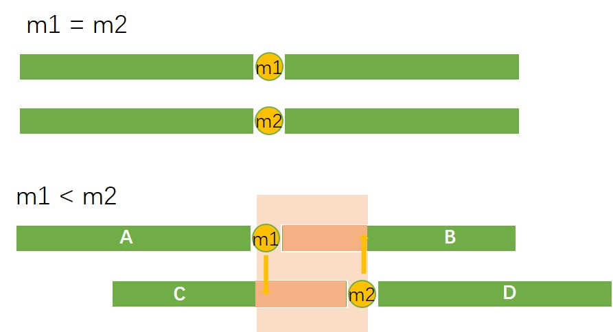
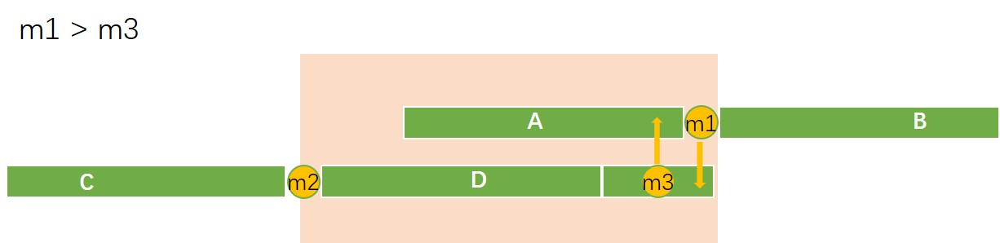
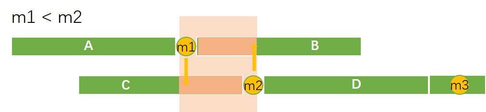
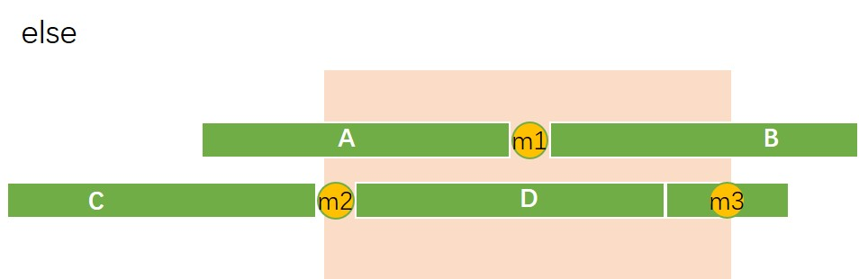

# Sort

[TOC]

### 0. 减治法

众数：数量在**一半以上**的元素

则众数必然是中位数



向量$S$的前缀$P$ ($P$的长度为偶数)

如果恰有一半元素为$x$，那么可以剪枝掉前缀$P$

* $S$中有数要成为众数，必须在剩下绿色达到一半以上。

```cpp
int majEleCandidate(vector<int> A){
    int maj;//众数
    for(int c = 0,i = 0;i < A.size();i++){
        if(c == 0){ // c代表maj的个数
            maj = A[i];
            c = 1;
        }
        else
        	maj = A[i]?c++:c--;
    }
    return maj;
}
```


### 1. 归并排序中的中位数

已知有序向量$S_1,S_2$ ，大小为$n_1,n_2$

#### 等长向量

$n_1= n_2 =n$

找到两个中位数，分别记为$m_1= S_1 \lfloor n/2 \rfloor, m_2 = S_2 \lceil n/2 \rceil -1$ ,偶数个会不太一样

1. $m_1=m_2$

   它们是$S$ 的中位数（递归终止条件）



2. $m_1 < m_2$

   按照归并排序，需要将AC和BD分别融合，而要找的中位数应该在粉色位置，那么可以完整地剪枝掉A、D

每次剪枝减掉一半，时间复杂度是$O(\log n)$

#### 不等长向量

让长度小的作$S_1$，将$S_2$ 按找$S_1$的大小切出来一块。

1. $m_1 < m_3$

   去掉（剪枝）B,C



2. $m_1 < m_2$

   去掉（剪枝）A,D,$S_3$



3. else

   $S_1$不变，$S_2$ 两端缩短

   

复杂度：$O(\log \min(n_1,n_2))$

所以等长才是最慢的


### 2. 找第k大的数

#### 快排

```cpp
int QuickSelect(int *arr, int k,int Size) {
    for(int low = 0, high = Size - 1; low < high; ) {
        int i = low, j = high, pivot = arr[low]; //随机选取pivot，这里选第一个
        while(i < j) {
            while(i < j && arr[j] >= pivot) j--; //从右向左找第一个小于pivot的数
            if(i < j) arr[i++] = arr[j]; //将该数移到低端
            while(i < j && arr[i] <= pivot) i++; //从左向右找第一个大于pivot的数
            if(i < j) arr[j--] = arr[i]; //将该数移到高端
        }
        arr[i] = pivot; // 将pivot的坑填上
        if(i == k) break; 
        else if(i < k) low = i + 1; //在右边找第k大的数
        else high = i - 1; //在左边找
    }
    return arr[k]; 
}
```

#### LinearSort

1. 递归基：长度小于Q。$O(Q) =O(1)$
2. 子序列划分：每个长度都是Q。$O(n)$
3. 分别找到子序列的中位数。$O(Q \times n/Q) =O(n)$
4. 全局中位数：在$n/Q$个中位数中。$O( n/Q) =O(n)$
5. 划分数集：一趟扫描。$O(n)$
6. 选择第k大：$T(3n/4)$ 。$\max(|L|,|G|) \le 3n/4$

```cpp
int LinearSelect(int *arr, int k ,int size) {
    if(size < Q) return QuickSelect(arr, k, size); // 递归基

    int *medians = new int[size / Q]; // 分割成Q大小的子数组
    for(int i = 0; i < size / Q; i++) {
        int *subarr = new int[Q];
        for(int j = 0; j < Q; j++) {
            subarr[j] = arr[i * Q + j];
        }
        medians[i] = QuickSelect(subarr, Q / 2, Q); // 找到每组的中位数
    }

    int median = LinearSelect(medians, size / Q / 2, size / Q); // 递归找到中位数的中位数
    // 分成了三组：小于中位数的，大于中位数的，等于的没有存储
    int *low = new int[size]; 
    int *high = new int[size];
    int lowSize = 0, highSize = 0;
    for(int i = 0; i < size; i++) {
        if(arr[i] < median) low[lowSize++] = arr[i];
        else if(arr[i] > median) high[highSize++] = arr[i];
    }
    int res = median;
    if(k < lowSize) res = LinearSelect(low, k, lowSize); // 递归找到第k大的数
    else if(k >= size - highSize) res = LinearSelect(high, k - (size - highSize), highSize);
    delete[] low;
    delete[] high;
    delete[] medians;
    return res;
}
```

### 3. 总结

* Quick Sort
  * 平均$O(n\log n)$
  * $T(n) = n + 2T(n/2)$

* QuickSelect：不用排序
  * 平均$O(n)$
  * $T(n) = n + T(n/2)$
* Linear Select
  * 防止QuickSelect出现最坏情况：有序