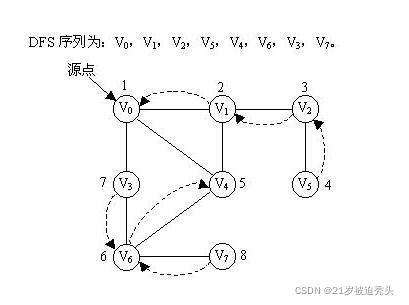

# Topological Sort

### 0. DFS

```cpp
vector<int> a; // 记录每次排列 
vector<int> visit; //标记是否被访问 

void DFS(int cur, int k, vector<int>& nums){
    if(cur == k){ //k个数已经选完，可以进行输出等相关操作 
        for(int i = 0; i < cur; i++){
			printf("%d ", a[i]);
		} 
        return ;
    }
    for(int i = 0; i < k; i++){ //遍历 n个数，并从中选择k个数 
        if(visit[nums[i]] == 0){ //若没有被访问
            a.push_back(nums[i]); //选定本输，并加入数组 
            visit[nums[i]] = 1; //标记已被访问 
            DFS(cur + 1, n, nums); //递归，cur+1 
            visit[nums[i]] = 0; //释放，标记为没被访问，方便下次引用 
            a.pop_back(); //弹出刚刚标记为未访问的数
        }
    }
}

```

1. 初始原点为v0，先访问 v0 -> v1 -> v2 -> v5，到 v5 后，回溯到 v1 （最近的且连接有没访问结点）
2. 从 v1 出发，访问 v1 -> v4 -> v6 -> v3，此时与v3相连的两个结点 v0 与 v6 都已经访问过，回溯到 v6 (v6 具有没访问过的结点)；
3. 此次从 v6 出发，访问 v6 -> v7，到 v7 后面没有结点，回溯；
4. 一直回溯到源点 v0 ，没有没访问过的结点，程序结束。



#### 应用

| 连通图的支撑树（DFS/BFS Tree） | DFS/BFS |
| ------------------------------ | ------- |
| 非连通图的支撑森林             | DFS/BFS |
| 连通性检测                     | DFS/BFS |
| 无向图环路检测                 | DFS/BFS |
| 有向图环路检测                 | DFS     |
| 顶点之间可达性检测/路径求解    | DFS/BFS |
| 顶点之间的最短距离             | BFS     |
| 直径                           | BFS     |
| Eulerian tour                  | DFS     |
| 拓扑排序                       | DFS     |
| 双连通分量、强连通分量分解     | DFS     |

### 1.定义

拓扑排序（Topological Sorting）是一个有向无环图（DAG, Directed Acyclic Graph）的所有顶点的线性序列。且该序列必须满足下面两个条件：

- 每个顶点出现且只出现一次。
- 若存在一条从顶点 A 到顶点 B 的路径，那么在序列中顶点 A 出现在顶点 B 的前面。

### 2.写

1. 从 DAG 图中选择一个 没有前驱（即入度为0）的顶点并输出。
2. 从图中删除该顶点和所有以它为起点的有向边。
3. 重复 1 和 2 直到当前的 DAG 图为空或**当前图中不存在无前驱的顶点为止**。后一种情况说明有向图中必然存在环。

一个有向无环图可以有**一个或多个**拓扑排序序列。

```cpp
 vector<int> topological_sort() {
        // 创建一个vector用于存储每个节点的入度数
        vector<int> in_degree(adj_list.size(), 0);

        // 统计每个节点的入度数
        for (int i = 0; i < adj_list.size(); i++) 
            for (int j = 0; j < adj_list[i].size(); j++) 
                in_degree[adj_list[i][j]]++;
     
        //将入度数为0的节点加入队列q
        queue<int> q;
        for (int i = 0; i < adj_list.size(); i++) 
            if(in_degree[i] == 0)
                q.push(i);
       
        // 创建一个vector用于存储排序后的节点序列
        vector<int> res;

        // 不断从队列中取出节点，并将其加入结果序列中
        while (!q.empty()) {
            int node = q.front();
            q.pop();
            res.push_back(node);

            // TODO:将当前节点的所有邻居节点的入度数减1
            for(int i = 0; i < adj_list[node].size(); i++) {
                // 如果减1后邻居节点的入度数变为0，则将其加入队列
                if(--in_degree[adj_list[node][i]] == 0)
                    q.push(adj_list[node][i]);
            }            
        }

        // 如果结果序列的长度小于节点数，则说明图中存在环
        // 返回一个空序列表示无法完成拓扑排序
        if (res.size() < adj_list.size()) 
            return vector<int>();

        // 返回排序后的节点序列
        return res;
    }
```


### 3.应用

“排序”具有依赖关系的任务。（先导课，工序）


### 4.实现

关键是要**维护一个入度为0的顶点的集合**。

