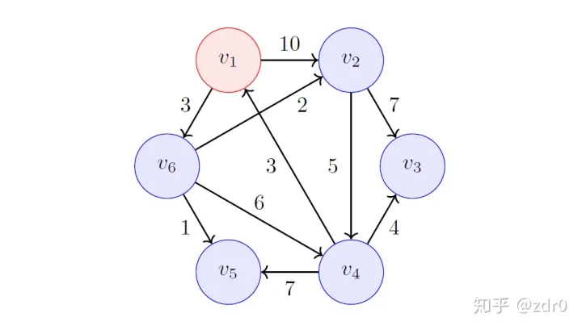

# Dijkstra

单源最短路

[TOC]

### 1. 过程

输入：赋权有向图$G = (V,E,W)$,$V = {v_1,v_2,...,v_n},s:=v_1$ 。
输出：从源点 $s$ 到所有的$v_i \in V$ \ $\{s \}$ 的最短路径。

1. 初始$S = \{ v_1 \}$ ；
2. 对于 $v_1 \in V-S$ ，计算 $dist[s,v_i]$ ；
3. 选择 $\min_{v_j} \in dist[s,v_i]$，并将这个 $v_j$ 放进集合 $ S $ 中，更新 $  V-S $ 中的顶点的 dist 值；
4. 重复 1 ，直到$ V=S $。

```python
S = {s}
dist[s,s] = 0
for vi : V-S 
    dist[s,vi] = w(s,vi)
    
while V != S do
	find min{dist[s,vi]}
    S.push(vi)
    for vi : V-s # 更新最短路
        if dist[s,vj] + w(vi,vj) < dist[s,vi] then
        	dist[s,vi] = dist[s,vj] + w(vi,vj)
```


### 2. 例子



1. 初始时，$ S = \{v_1\}$

   | 点    | $ dist[v_i, v_1] $ | 上一个点 |
   | ----- | ------------------ | -------- |
   | **1** | 0                  |          |
   | 2     | 10                 | 1        |
   | 3     | $ \infty $         |          |
   | 4     | $ \infty $         |          |
   | 5     | $ \infty $         |          |
   | 6     | 3                  | 1        |

   

2. 在集合$ V-S=\{v_2,...v_6\} $，中找到最小的dist，将该点加入集合S。$ S =\{v_1,v_6\}$

   计算每个点的$dist[v_1,v_i] =dist[v_1,v_6] + w(v_6,v_i)$，如果比原来小，则更新

   | 点    | $ dist[v_i, v_1] $ | 上一个点 |
   | ----- | ------------------ | -------- |
   | **1** | 0                  |          |
   | 2     | 5                  | 6        |
   | 3     | $ \infty $         |          |
   | 4     | 9                  | 6        |
   | 5     | 4                  | 6        |
   | **6** | 3                  | 1        |

3. 重复：$S =\{v_1,v_6,v_5\}$。这次没有更新

4. $S =\{v_1,v_6,v_5,v_2\}$

   | 点    | $ dist[v_i, v_1] $ | 上一个点 |
   | ----- | ------------------ | -------- |
   | **1** | 0                  |          |
   | **2** | 5                  | 6        |
   | 3     | 12                 | 2        |
   | 4     | 9                  | 6        |
   | **5** | 4                  | 6        |
   | **6** | 3                  | 1        |

5. $S =\{v_1,v_6,v_5,v_2,v_4\}$。这次没有更新

6. $S =\{v_1,v_6,v_5,v_2,v_4,v_3\}$。这次没有更新

7. $ V=S $，终止。

### 3. 小结

* 不能有负权重。因为加入到S集合中的点不再更新dist，会错过负权重带来的更小的dist
* $O(e+v^2)$

* 优化：在每次寻找最小dist的时候耗时较长，可用优先队列或二叉堆$ O((e+v)\log v)$

### 4.其他最短路算法

* 单源最短路
  * 无负权重：Dijkstra
  * 负权重：Bellman-Ford, SPFA
* 多源最短路
  * Floyd
* 路径规划
  * A*算法